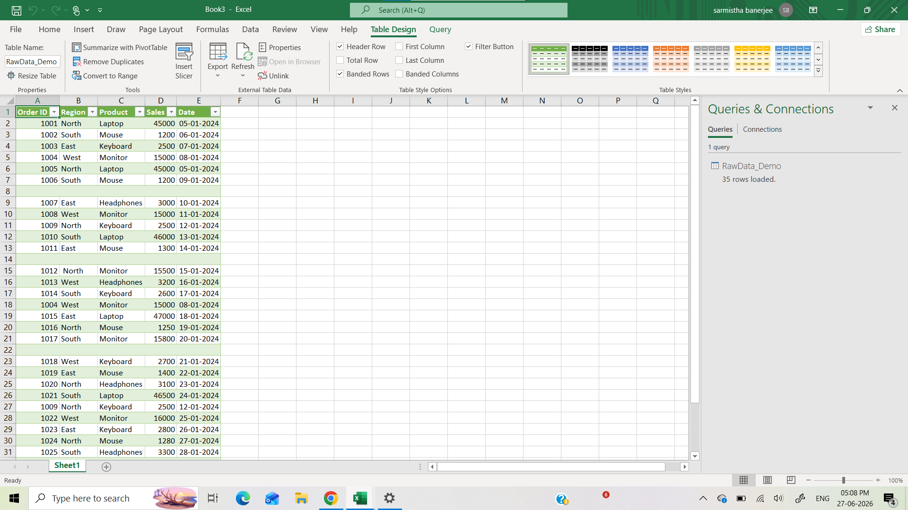
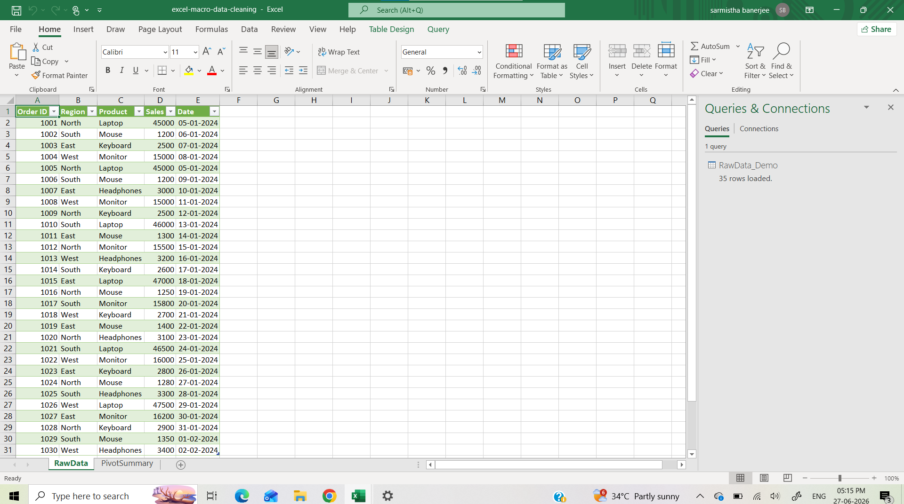
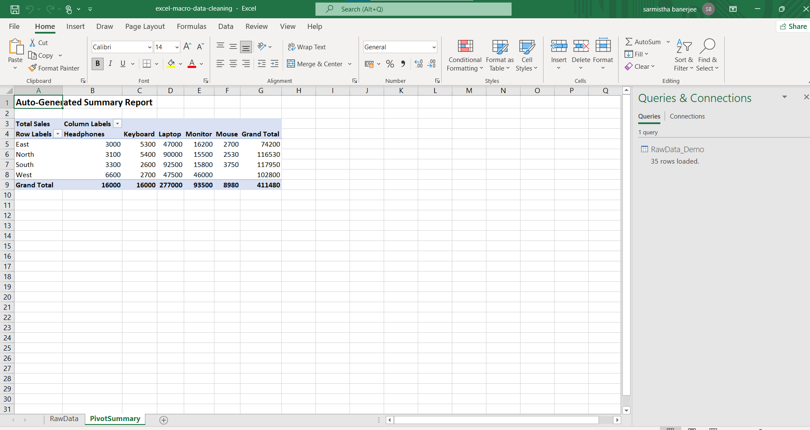

# Excel-macro-data-cleaning-pivot
VBA macro that automates Excel data cleaning and builds a pivot table summary

## Problem Statement
Manually cleaning raw sales data (blank rows, duplicates, inconsistent 
spacing, and incorrect data types) before building reports is repetitive 
and error-prone.

## What the Macro Does
- Removes blank rows
- Trims whitespace from text fields
- Ensures numeric columns are properly typed
- Removes rows that became blank after cleaning
- Removes duplicate records
- Auto-generates a Pivot Table summary (Region × Product × Total Sales)

## Tools
Excel VBA (Macros), Pivot Tables

## Before

## After

